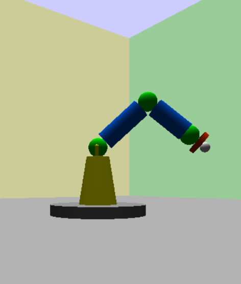

<h1> Articulated_arm </h1>
Repozytorium w celach przechowywania plików związanych z projektem z obiektówki - Animacja robota articulated_arm

<h2> CEL PROJEKTU I STRESZCZENIE </h2>
Celem projektu było zrealizowanie sterowalnej przez użytkownika wizualizacji trójwymiarowego ramienia robota typu articulated arm - robota o 3 stopniach swobody. Projekt został wykonany w języki Python z pomocą takich bibliotek jak OpenGL, FreeSimpleGUI oraz innych bibliotek wspomagających obliczenia i łączność między oknami GUI. Program wykorzystuje paradygmat programowania obiektowego – każda część ramienia została zaimplementowana jako osobna metoda w obrębie klasy reprezentującej całe ramię robota. Projekt umożliwia wizualizację ruchów ramienia w czasie rzeczywistym, a jego struktura ułatwia dalszy rozwój i rozbudowę o dodatkowe funkcjonalności.

<h2> STRUKTURA PROGRAMU </h2>
* Main.py – jest to główny plik wykonawczy. Sprzęga wszystkie pozostałe pliki oraz inicjalizuje działanie całego programu.
* Articulated_arm.py – plik zawiera funkcje klasowe. W tym pliku realizowane jest rysowanie odpowiednich elementów ramienia robota.
* Coordinates.py – plik, w którym wykonywane są wszystkie obliczenia wymagane do określenia obecnej pozycji chwytaka, do przemieszczenia robota na konkretne koordynaty.
* Controls.py – plik, który obsługuje sterowanie klawiaturą/interfejsem.
* Surroundings.py – plik zawierający implementacje funkcji, które rysują obiekty dodatkowe, takie jak światło, podstawa robota, pomieszczenie oraz dodatkowy obiekt.
* Controls_window.py - opcjonalny plik, który tworzy okno do sterowania ramieniem. Niestety w aktualnej wersji programu GUI blokuje funkcję uczenia i odtwarzania ruchów.

<h2> FUNKCJONALNOŚCI </h2>
Program umożliwia użytkownikowi sterowanie robotycznym ramieniem za pomocą klawiszy przedstawionych w rozdziale "STEROWANIE". Konkretne funkcjonalności obejmują:
* Sterowanie widokiem kamery
* Sterowanie trzema segmentami robota
* Przemieszczenie chwytaka na zadane koordynaty
* Nagrywanie ruchu oraz go odtwarzanie
* Przenoszenie obiektu pomocniczego za pomocą chwytaka magnetycznego

<h2> STEROWANIE </h2>

* strzałki - obsługują ruch kamery użytkownika
* 1, 2 - obsługują obrót pierwszego segmentu robota
* 3, 4 - obsługują obrót drugiego segmentu robota
* 5, 6 - obsługują obrót trzeciego segmentu robota
* L - nagrywa kolejne 5 sekund ruchu robota
* P - odtwarza zapisany ruch (jeśli takowy został nagrany)
* K - pozwala wprowadzić koordynaty, na które ma przemieścić się chwytak robota
* M - włącza chwytak magnetyczny

* Wykrywanie przedmiotu w pobliżu w celu uchwycenia go magnesem (na razie przedmiot jest przyciągany na milion kilometrów, a tak właściwie to się teleportuje)  
* Płynne przemieszczenie się efektora przy ruchu nauczonym i zmienieniu pozycji

<h2> WYGLĄD </h2>

